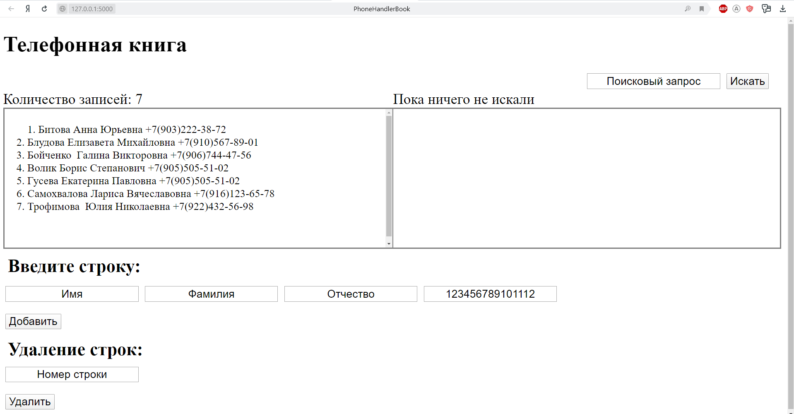

# PhoneBook
## Телефонная книга в Web на Flask (Python) с SQLite базой данных:
-----------------------------------------------------------------

-----------------------------------------------------------------
### Для установки: 
- создать виртуальное окружение(здесь virtualenv)
- установить в нём пакет Flask
- Скопировать в созданную директорию окружения файлы: start.py, datebase.db; директории: static, templates
- задать параметр запуска 
  
  - SET FLASK_APP=start.py (Для Win)

### Для запуска:

- flask run

### Файлы:

- pyvenv.cfg - конфигурация виртуального окружения

- requirements.txt - текущие версии пакетов, получаем с помощью команды pip freeze > requirements.txt

- static - стили

- templates - html шаблон 
